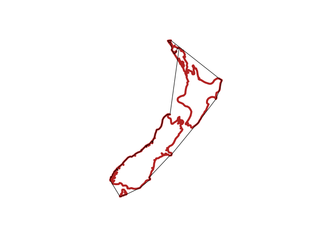
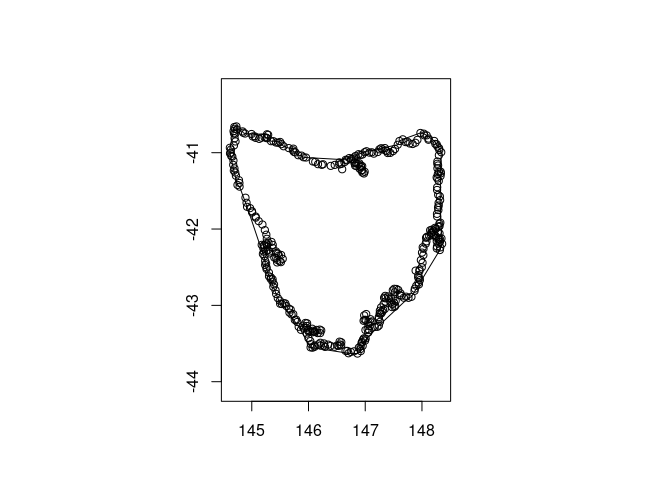

<!-- README.md is generated from README.Rmd. Please edit that file -->

# cchull

Concave hull with ‘concaveman’ C++ library.

Modified from Mark Padgham’s demonstration
[concavetest](https://github.com/mpadge/concavetest).

Install

``` r
remotes::install_github("mdsumner/cchull")
```

Example

``` r
library(cchull)
m <- maps::map(regions = "new zealand", plot = FALSE, xlim = c(160, 179), ylim = c(-50, -40))
maps::map(m, col = "firebrick", lwd = 4)
bad <- is.na(m$x)
lines(cchull(m$x[!bad], m$y[!bad], concavity = 15))

plot(ozmaps::ozmap_states$geometry[6][[1]][[14]][[1]], asp = 1/cos(42 * pi/180), xlab = "", ylab = "")
```

<!-- -->

``` r
mat <- ozmaps::ozmap_states$geometry[6][[1]][[14]][[1]]
lines(cchull(mat[,1], mat[,2]))
```

<!-- -->

## Code of Conduct

Please note that the cchull project is released with a [Contributor Code
of
Conduct](https://contributor-covenant.org/version/2/1/CODE_OF_CONDUCT.html).
By contributing to this project, you agree to abide by its terms.
